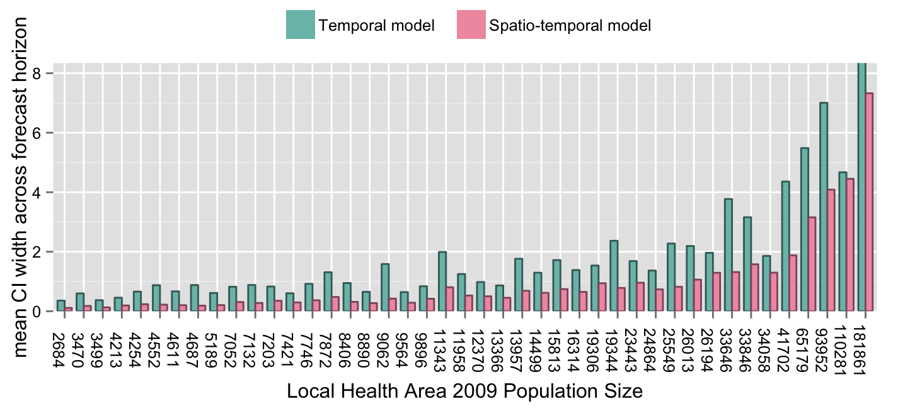

I use Poisson GLM and hierarchical models all the time. I recently observed what appeared to be a super weird result: I had predicted values for an outcome and estimated the credible intervals around the forecasts, for two models. One was just a time-series, and one included spatial smoothing as well. As expected, the spatial smoothing traded a bit of bias for a much better prediction interval. But, on the advice of a clever friend, I plotted the average prediction interval width in a bar graph against population size. And what I saw was something that made absolutely no sense to me at first.

<!--more-->

It looked something like this: 

 
Figure 1: WTF? 

Even my committee at first was confused. Why would regions with larger populations have larger prediction variance? In hindsight it's obvious - we have Poisson data with variable group sizes (offsets), and therefore we should be comparing the precision of the predicted rates, not counts. Clearly the count precision will be *positively*, not *negatively*, correlated with the expected count, which is itself correlated with population size.  

To figure this out, I ended up doing a little simulation exercise: 

First, I simulate data for a Poisson GLM with an offset (population)

```{r}
N = 1000
x = rnorm(N,1,0.5) 
beta0 = 0
beta1 = 0.05
pop = round(runif(N,500,5000),0) 
lambda = exp(beta0 + beta1* x + log(pop)) 
y = rpois(N,lambda) 
```

Second, I fit a Poisson GLM to the data 
```{r}
m = glm(y ~ x, family="poisson",offset=log(pop)) 
```

Third, I generate new out-of-sample data for x and population. 

```{r}
x.pred   = rnorm(100, 3,0.5) 
pop.pred = seq(100,10000,100) 
newdata = data.frame( x=x.pred, pop = pop.pred) 
```


Now we view the prediction standard errors of the counts as a function of the offset (population size) 

```{r, fig.height=4, fig.width=4, fig.align='center'}
se.predict.count = predict.glm(m,newdata=newdata, se.fit=TRUE,type="response")$se.fit 
plot(pop.pred,se.predict.count,ylab="prediction standard error for counts",  pch=16,col="#4b6cb7",xlab="offset (population)") 
```
 
The offset and the prediction standard error (for count values) are positively correlated by definition (given how the data are generated in the simulation or assumed to be generated in real datasets). 
test 

$$ y_i \sim pois( \mu_i) $$ 

$$log( \frac{\mu_i}{pop_i}) = \beta_0 + \beta_1 x_i $$ 

$$\mu_i = exp(\beta_0 + \beta_1 x_i + log(pop_i)) = exp(\beta_0 + \beta_1 x_i) * pop_i$$  


This can be counter-intuitive since one would expect larger sample or population sizes to yield better precision. But when we include an offset, we should look at the standard error of the rate if we are going to compare across groups with different population sizes generating the counts. 


So now instead let's view the prediction standard errors of the **rates** as a function of the offset (population size). 

The model parameters from the fit model were based on rates - recall that including the offset changes the other parameter values - and so to estimate the a predicted rate we exclude any offset in the prediction. To estimate a count for a given region or group, the rate can be  multiplied by the group size.  

There are two equivalent ways to estimate the standard errors of new predicted rates: 

1. Set each group size to 1 as log(1) = 0 in the prediction dataset, then extract prediction variance 
2. Use the offset in the prediction, but divide the prediction variance for the count by the population 

The equivalency is shown below. There is no longer any correlation between the population size generating the counts and the prediction variance, because all are now based on standardized rates.  

```{r, fig.height=4, fig.width=8, fig.align='center'}

pop.fixed = rep(1,100) 
newdata.fixed = data.frame(x=x.pred, pop=pop.fixed)   

se.predict.rate1 = predict.glm(m,newdata=newdata.fixed, se.fit=TRUE,type="response")$se.fit 
se.predict.rate2 = se.predict.count / pop.pred 

par(mfrow=c(1,2)) 

plot(pop.pred,se.predict.rate1,ylab="prediction standard error for rates",  pch=16,col="#4b6cb7",xlab="offset (population)") 

plot(pop.pred,se.predict.rate2,ylab="prediction standard error for rates",  pch=16,col="#4b6cb7",xlab="offset (population)") 

```
 


