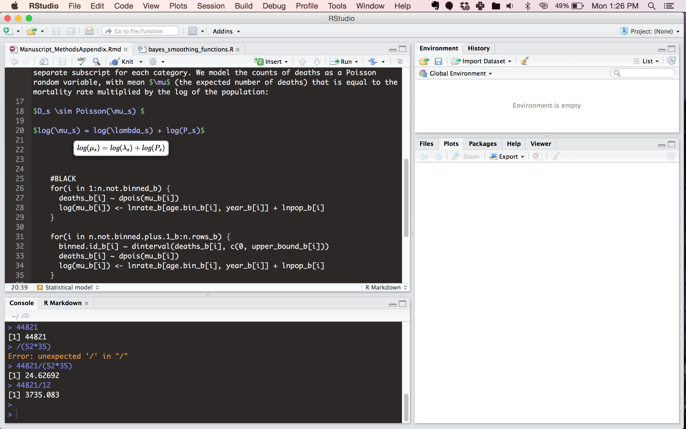

I am loving some of the changes to the latest version of [R Studio](https://www.rstudio.com/). This is my favourite addition so far. As I write latex math mode in markdown, it will auto-render what the equations will look like when compiled. Saves me a lot of time making sure I got all the subscripts, etc correct without having to compile so often.  

 

 

